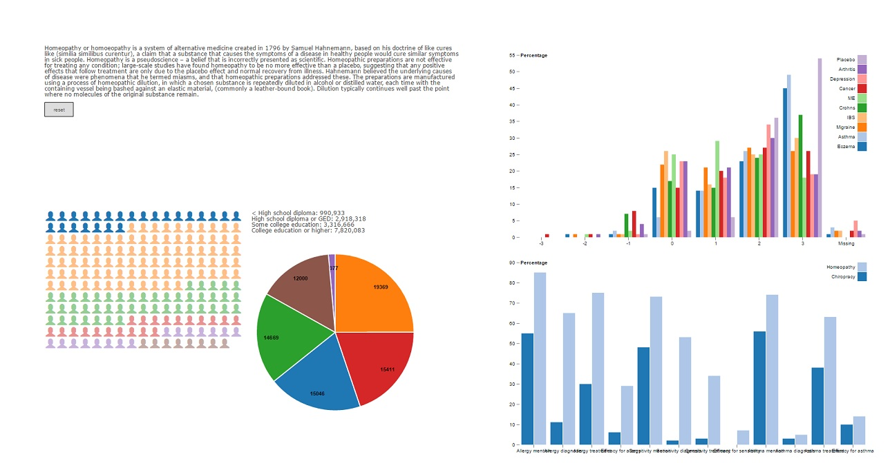

# Programmeerproject

This project aims to show the amount of money that is spent on or in the name of pseudo-science, like the Myer-Briggs personality type test. Starting out with a quiz users will get a couple of questions meant to surprise and entice the user to want to find out more. Following this they are led to the main visualization which they can explore at their leisure, showing the startling amounts of money these unproven and unscientific fields garner. Choosing one of the fields will give a description (source: Wikipedia) of said field, as well as some visualizations showing the shaky foundations (or total lack thereof) that the field is based on.

Thanks go out to Mike Bostock for making his D3 templates so readily available. They were used as the basis for the graphs which where then modified to fit my needs. Also to Fiddle user natmit who created the fiddle the quiz was based off of.

## Data Sources

* https://www.cdc.gov/nchs/data/nhsr/nhsr012.pdf

### Myers-Briggs
* https://www.theguardian.com/science/brain-flapping/2013/mar/19/myers-briggs-test-unscientific
* http://www.indiana.edu/~jobtalk/HRMWebsite/hrm/articles/develop/mbti.pdf (measuring the mbti)
* http://www.smithsonianmag.com/smart-news/the-myers-briggs-personality-test-is-pretty-much-meaningless-9359770/
* http://rer.sagepub.com/content/63/4/467.abstract
* http://www.researchgate.net/publication/232494957_Cautionary_comments_regarding_the_Myers-Briggs_Type_Indicator/file/32bfe50cb18c2dbfd4.pdf
* http://www.sciencedirect.com/science/article/pii/0191886996000335
* https://www.psychologytoday.com/blog/give-and-take/201309/goodbye-mbti-the-fad-won-t-die
* http://journals.sagepub.com/doi/abs/10.1177/014920639602200103 (literature review)

### Chiropractic

* https://www.ncbi.nlm.nih.gov/pubmed/20184717 (effectiveness report)
* https://www.ncbi.nlm.nih.gov/pubmed/20642715 (deaths after chiropractic)
* https://www.theguardian.com/lifeandstyle/2012/may/14/dangers-chiropractic-treatment-under-reported
* https://www.theguardian.com/commentisfree/2008/apr/19/controversiesinscience-health
* https://www.ibisworld.com/industry/default.aspx?indid=1559 (statistics for dataset)

### Homeopathy

* https://www.theguardian.com/science/blog/2012/apr/03/homeopathy-why-i-changed-my-mind
* https://www.ncbi.nlm.nih.gov/pubmed/12492603 (systemetic review of systemetic reviews)
* https://www.ncbi.nlm.nih.gov/pubmed/16296912 (observational study (positive effect))
* http://online.liebertpub.com.proxy.uba.uva.nl:2048/doi/pdf/10.1089/acm.2005.11.793
* http://www.nutraceuticalsworld.com/issues/2013-07/view_industry-news/us-sales-of-homeopathic-herbal-remedies-reach-64-billion (dataset)
* http://www.transparencymarketresearch.com/pressrelease/homeopathy-product-market.htm (dataset)

### Psychics
* https://www.theguardian.com/science/2012/aug/16/psychic-sally-morgan-deluded-harmless
* http://moh2005.proboards.com/thread/10178?page=1 (forum on sally specifically, more for my own entertainment :p)
* https://www.ibisworld.com/industry/psychic-services.html (dataset, also includes astrology)

### Faith healing / Reiki
* https://www.ncbi.nlm.nih.gov/pubmed/23210468
* http://www.reikitablereviews.com/wp-content/uploads/2015/01/infographic_massage_therapy_industry.jpg

### Aromatherapy
* http://www.grandviewresearch.com/industry-analysis/essential-oils-market
* http://www.livescience.com/52080-essential-oils-science-health-effects.html
* https://www.sciencedaily.com/releases/2008/03/080303093553.htm
* http://bjgp.org/content/bjgp/50/455/493.full.pdf (Ernst 2000)
* http://www.sciencedirect.com/science/article/pii/S0378512212000060 (Ernst 2012)
